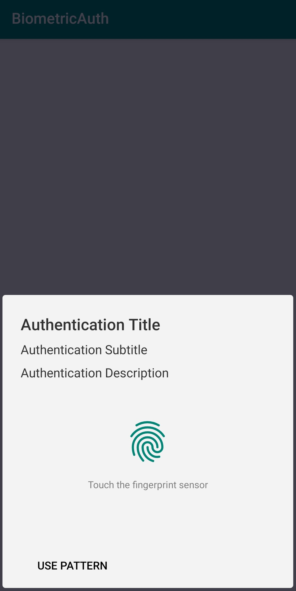
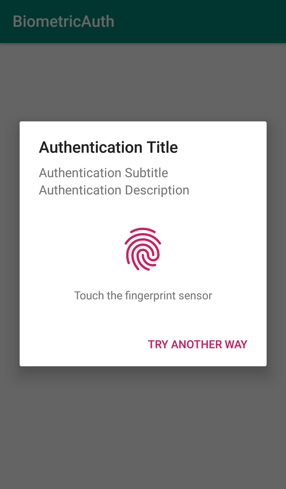

# android-authenticate-user


Authenticate user by biomatric and system lock .

[](https://jitpack.io/#JuniorClone/android-authenticate-user)

## How to integrate the library in your app?
### Add it in your root build.gradle at the end of repositories:

```
allprojects {
		repositories {
			...
			maven { url 'https://jitpack.io' }
		}
	}
  ```
  
 ### Add the dependency
 
 ```
 dependencies {
	        implementation 'com.github.JuniorClone:android-authenticate-user:1.0.1'
	}
  ```
  
## screenshot

<p align="center">
  
   
</p>


## Usage

```
/*
 * If You need only biomatric authentication then set 'setConfirmationRequired(false)'
 */
AuthManager authManager = new AuthManager.AuthMangerBuilder(MainActivity.this)
                .setTitle("Authentication Title")
                .setSubtitle("Authentication Subtitle")
                .setDescription("Authentication Description")
                .setNegativeButtonText("Cancel")
                .setConfirmationRequired(true)
                .Builder();

/*
 * add AuthCallback interface or implement method and add MainActivity.this
 */
authManager.authenticate(authCallback);
```

```
AuthCallback authCallback = new AuthCallback() {
            @Override
            public void onSdkVersionNotSupported() {
                 /*  
		  *  Will be called if the device sdk version does not support
                  */
            }

            @Override
            public void onAuthenticationPermissionNotGranted() {
		 /*  
		  *  android.permission.USE_BIOMETRIC permission is not granted to the app
                  */
            }

            @Override
            public void onAuthenticationInternalError(String error) {
                     /*  
                      *  This method is called if one of the fields such as the title,
                      * subtitle or Description is empty
                      */
            }

            @Override
            public void onAuthenticationFailed() {
                      /*  
                       * When Auhentication Failed in any case
                       */
            }

            @Override
            public void onAuthenticationSuccessful() {
                      /*  
                       * User Authentication Success
                       */
            }

            @Override
            public void onAuthenticationError(int errorCode, CharSequence errString) {
                         /*  
                          * When an unrecoverable error has been encountered and the authentication process has 
                          * completed without success, then this callback will be triggered. The callback is provided 
                          * with an error code to identify the cause of the error, along with the error message. 
                          */
            }
        };
```

```
/*
 *call authManager.onActivityResult() function to handel Authentication callback
 */
@Override
    protected void onActivityResult(int requestCode, int resultCode, @Nullable Intent data) {
        super.onActivityResult(requestCode, resultCode, data);
        if (Build.VERSION.SDK_INT >= Build.VERSION_CODES.M) {
            authManager.onActivityResult(requestCode,resultCode,data);
        }
    }
```
